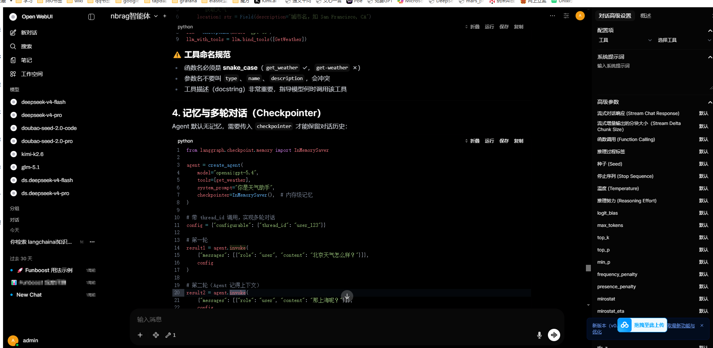

# nbrag

**让 AI 基于真实内容回答，消除幻觉** — 把代码、文档、法律条文、技术手册等任何文本导入 nbrag，AI Agent 就能基于真实内容回答问题，不再凭训练数据"编"。

nbrag 是一个 Agentic RAG MCP Server：AI Agent 通过 11 个 MCP 检索工具 + `nbrag_help` 导航工具自主多轮检索，支持接入 Cursor、Claude Code/Desktop、OpenCode、Cherry Studio、Open WebUI、Dify、Cline 等任何 MCP 兼容的 AI 产品。

### 典型场景

- **专业知识**：法律法规全文、医学指南、行业标准——任何需要 AI 精准引用而非"大概记得"的领域
- **内部资料**：公司 wiki、产品手册、设计文档、运营规范——公开服务永远不可能收录的内容
- **技术资料/源码**：LangChain 等三方库更新太快、内部框架预训练不足时，把文档和源码导入成知识库

## 为什么不用 Context7？

Context7 是优秀的 MCP 文档服务（56K+ stars），但它是"预制菜"——只能查它已收录的公开库文档片段。

| | Context7 | **nbrag** |
|---|---------|-----------|
| 数据来源 | Upstash 预索引的 GitHub 文档 | **用户自己导入任何文件** |
| 内容深度 | 公开文档片段 | **原文级**（按文件、行号、上下文读取用户导入内容） |
| 私有库/内部框架 | 不支持 | **完全支持** |
| 更新时效 | 取决于 Context7 爬取频率 | **导入即可用** |
| 检索管线 | 向量搜索 + 重排序 | **BM25 + Vector + RRF + Reranker 四级管线** |
| 离线/自部署 | 依赖 context7.com 云服务 | **本地 ChromaDB + 可配置 API** |
| 工具数量 | 2 个 | **11 个检索工具 + 1 个导航工具**（搜索 + grep + AST 定位 + 文件定位 + 原文读取 + help） |

**两者互补**：Context7 适合快速查它已收录的公开库文档；nbrag 适合你自己准备的本地/私有/专业文本，也适合需要更高检索质量的源码和技术资料。

## 为什么不是 Naive RAG？

| | Naive RAG | **Agentic RAG (本项目)** |
|---|-----------|----------------------|
| 检索触发 | 每次提问自动检索 top-5 注入 | AI 自主决定是否检索、用哪个工具 |
| 检索轮次 | 1 次 | 多轮（实测 m 次搜索 + n 次文件读取） |
| 查询构造 | 用户原文 | AI 重写查询、组合多种检索策略 |
| 工具种类 | 仅语义搜索 | 混合检索（Vector + BM25 → RRF 融合）+ grep + 文件定位 + 原文读取 + Python AST 符号定位 |
| 分析深度 | 浅层描述 | 跨文档证据链 + 原文上下文 |
| 准确度 | 浅层匹配，容易遗漏 | **显著优于 Naive RAG**，跨资料关联更完整 |

核心观点：**检索不是管道，是 Agent 的一种能力。**

### 为什么不在 nbrag 内部做 Query Rewrite？

nbrag 刻意**不在内部做查询改写**（虽然技术上可以加），因为 AI Agent 本身就是最好的 query rewriter：

```
用户: "公司让我试用期干了5个月不转正，签1年合同，合法吗？能要什么赔偿？"
         ↓
    AI Agent（理解问题 → 拆解 → 重写查询）
         ↓
  第1轮: nbrag_search_and_fetch("试用期 最长期限 1年合同")        → 命中第19条并取回原文
  第2轮: nbrag_search_and_fetch("违法约定试用期 赔偿标准")        → 命中第83条并取回原文
  第3轮: nbrag_grep("第十九条")                          → 精确定位原文
  第4轮: nbrag_get_raw_file(...)                         → 读完整法条上下文
         ↓
    AI 综合 4 轮结果，给用户完整回答
```

AI 理解上下文、对话历史和领域知识，它改写查询的效果远好于任何规则引擎或小模型。所以 nbrag 的设计原则是：**把"智能"留给 AI，把"工具"做好给 AI 用。**

## 快速开始

### 1. 安装

```bash
# 方式 A: uvx (推荐，零安装)
uvx nbrag

# 方式 B: pip
pip install nbrag
```

### 2. 配置 API Key

```bash
# SiliconFlow 免费 API Key (https://siliconflow.cn)
export NBRAG_API_KEY=sk-xxx
```

### 3. 在 Cursor / Claude Desktop 中配置 MCP

有三种配置方式，选一种即可：

#### 方式 A: uvx 启动（推荐，零安装）

```json
{
  "mcpServers": {
    "nbrag": {
      "command": "uvx",
      "args": ["nbrag"],
      "env": {
        "NBRAG_API_KEY": "sk-xxx"
      }
    }
  }
}
```

#### 方式 B: python 命令启动

```json
{
  "mcpServers": {
    "nbrag": {
      "command": "python",
      "args": ["-m", "nbrag"],
      "env": {
        "NBRAG_API_KEY": "sk-xxx"
      }
    }
  }
}
```

#### 方式 C: HTTP 模式（推荐多项目共享）

> **为什么选 HTTP？** stdio 模式下每个 IDE 窗口会各起一个独立进程。如果你同时打开了几十个项目，
> 就是几十个 Python 进程 + 几十份 ChromaDB 内存。HTTP 模式只跑一个服务进程，所有 IDE 共享同一个端口，
> 省内存，也避免多进程并发写同一个 ChromaDB 数据库的锁冲突。

先启动服务：

```bash
# uvx 方式
uvx nbrag --transport streamable-http --port 9101

# 或 python 方式
python -m nbrag --transport streamable-http --port 9101
```

再配置客户端：

```json
{
  "mcpServers": {
    "nbrag": {
      "type": "http",  //可以省略,因为有url，就能自动推断是http模式
      "url": "http://localhost:9101/mcp"
    }
  }
}
```

#### 在openwebui 中配置nbrag mcp，通过rag知识库学习 langchain框架，截图如下：

nbrag是标准mcp，所以配置在任何个人agent和任意agent产品里面


### 4. 导入知识库

#### 手动脚本导入（推荐）

通过脚本导入可以精确指定目录、过滤文件后缀、控制 chunk 参数：

```python
from nbrag.core import batch_ingest

# 示例 1：导入法律法规、手册、内部文档等文本
batch_ingest(
    paths=["D:/docs/labor_law", "D:/docs/product_manuals"],
    collection_name="company_knowledge",
    file_extensions=[".md", ".txt", ".html"],
    delete_first=True,
    verbose=True,
)

# 示例 2：导入技术文档或源码
batch_ingest(
    paths=["D:/codes/my_project/src", "D:/codes/my_project/docs"],
    collection_name="my_project",
    file_extensions=[".py", ".md"],
    delete_first=True,
    verbose=True,
)
```

参见 `scripts/` 目录下的示例：
- `scripts/ingest_ex1/` — 《中华人民共和国民法典》全文导入示例
- `scripts/ingest_ex2_marriage_law/` — 婚姻家庭法司法解释导入示例
- `scripts/ingest_project.py` — 通用项目/文档导入模板

## 11 个 MCP 检索工具 + 1 个导航工具

| 类别 | 工具 | 功能 |
|------|------|------|
| **导航** | `nbrag_help` | 返回简短组合拳指南；AI 不确定该调哪个工具时先看它 |
| **混合检索** | `nbrag_search` | Vector + BM25 → RRF 融合 → Rerank 精排 |
| **混合检索** | `nbrag_search_and_fetch` | 混合搜索 + 自动取原文（省一次 round-trip） |
| **精确检索** | `nbrag_grep` | 关键词/正则搜索（法条编号、专业术语、API 名等精确匹配） |
| **精确检索** | `nbrag_find_definition` | Python 源码专用：AST 定位 class/function 完整定义（仅 `.py` 文件） |
| **文件定位** | `nbrag_find_files` | 根据文件名或路径片段找到完整绝对 `file_path` |
| **上下文扩展** | `nbrag_get_file_chunks` | 按 chunk 分页浏览文件 |
| **上下文扩展** | `nbrag_get_raw_file` | 读取无 overlap 的原始文件 |
| **上下文扩展** | `nbrag_get_adjacent_chunks` | 获取相邻 chunks |
| **上下文扩展** | `nbrag_get_chunks_by_lines` | 按行号范围取 chunks |
| **只读管理** | `nbrag_list` | 列出知识库所有文档 |
| **只读管理** | `nbrag_stats` | 知识库统计信息 |

### Help 与 Skill 指南（教 AI 打组合拳）

MCP 自带 `nbrag_help`，AI 即使不复制 Skill 也可以看到简短组合拳：`nbrag_stats` → `nbrag_search_and_fetch` → `nbrag_grep`（必要时 Python 源码再用 `nbrag_find_definition`）→ `nbrag_find_files` / `nbrag_get_raw_file`。

项目也附带一个 Skill 文件，打包在 `nbrag` 包内，提供更完整的多轮检索策略。复制 Skill 是增强体验，不是必需步骤。

**使用方法**：从 pip 安装路径复制到你项目的 Skills 目录，AI 就自动学会多轮检索策略。

```bash
# 先获取 skill 路径
SKILL_PATH=$(python -c "import nbrag, os; print(os.path.join(os.path.dirname(nbrag.__file__), 'skills', 'nbrag-workflow'))")

# Cursor
cp -r $SKILL_PATH .cursor/skills/

# Claude Code
cp -r $SKILL_PATH .claude/skills/

# nb_agent
cp -r $SKILL_PATH .nb_agent/skills/

# OpenAI Codex / Gemini CLI /nb_agent（跨平台标准）
cp -r $SKILL_PATH .agents/skills/
```

`nbrag_help` 内容短，适合作为 MCP-only 场景的默认导航；Skill 内容更详细，包括：发现（nbrag_stats）→ 检索（4 种策略选择）→ 文件定位（nbrag_find_files）→ 深入（4 种上下文获取方式）→ 多轮重试策略。

### AI 推荐的深度分析工作流

**通用知识场景**（法律条文、医学指南、技术手册、内部文档等）：
```
1. nbrag_search_and_fetch → 语义+关键词混合检索，并自动读取命中位置附近原文
2. nbrag_grep → 精确匹配条文编号、术语、标题、错误码、关键词
3. nbrag_get_raw_file → 读取完整原文确认上下文
4. nbrag_get_adjacent_chunks → 扩展上下文，查看前后条款或段落
5. 如只有文件名/路径片段，先用 nbrag_find_files 找完整绝对 file_path
```

**代码场景**（Python 源码、框架 API）：
```
1. nbrag_search_and_fetch → 混合检索并自动读取命中位置附近原文
2. nbrag_grep → 精确定位类名、方法名、常量、导入路径（行级精度）
3. nbrag_find_definition → 获取完整的类/函数定义（仅 .py 文件）
4. nbrag_get_raw_file → 读取完整源码验证细节
5. 跨文件追踪：发现未知符号时重复 2-4 步
```

所有 `file_path` / `filter_file_path` 入参都必须使用工具返回的完整绝对路径，例如 `D:/docs/labor_law/劳动合同法.md`。不要传 `劳动合同法.md`、`core.py` 或 `src/core.py` 这类短路径；如果只有文件名或路径片段，先调用 `nbrag_find_files` 找到唯一的完整路径。

## 向量数据库 Metadata 字段

每个 chunk 入库时除了 embedding 向量，还存储了丰富的 metadata。这是很多 RAG 方案忽略的关键设计——有了 metadata，才能实现按文件过滤、按行号定位、按作用域追踪等高级能力。

| 字段 | 类型 | 示例 | 说明 |
|------|------|------|------|
| `source` | str | `D:/docs/labor_law/劳动合同法.md` | 文件绝对路径（跨平台统一格式），也是 `file_path` / `filter_file_path` 的唯一依据 |
| `filename` | str | `劳动合同法.md` | 文件名（仅用于显示，不作为读取或过滤入参） |
| `doc_id` | str | `a1b2c3d4e5f6` | 路径 MD5 前 12 位（文件唯一标识） |
| `chunk_index` | int | `3` | 当前 chunk 在文件中的序号（0-based） |
| `total_chunks` | int | `15` | 该文件的总 chunk 数 |
| `line_start` | int | `120` | chunk 对应的起始行号（1-based） |
| `line_end` | int | `180` | chunk 对应的结束行号 |
| `scope` | str | `MyClass.my_method` 或空 | Python AST 解析的作用域（非 Python 文件为空） |

**chunk 头部注入示例**（embedding 前自动添加，提升搜索精度）：

```
# [File: D:/docs/labor_law/劳动合同法.md] [Lines: 120-180]
# Python 源码会额外注入 AST scope:
# [File: D:/codes/myproject/core.py] [Class: class MyClass(Base)] [Method: process] [Sig: def process(self, data: dict)] [Lines: 45-78]
```

有了这些 metadata + 头部注入，`nbrag_search` 搜 "试用期最长期限" 可以定位到具体法条文件和行号；在 Python 源码场景下，搜 "process 方法" 也能更容易命中 `MyClass.process`。

## 配置

### 环境变量

| 变量 | 必填 | 默认值 | 说明 |
|------|------|--------|------|
| `NBRAG_API_KEY` | **是** | | Embedding/Rerank API Key |
| `NBRAG_BASE_URL` | 否 | `https://api.siliconflow.cn/v1` | API Base URL |
| `NBRAG_EMBEDDING_MODEL` | 否 | `BAAI/bge-m3` | Embedding 模型 |
| `NBRAG_RERANK_MODEL` | 否 | `BAAI/bge-reranker-v2-m3` | Rerank 模型 |
| `NBRAG_DB_PATH` | 否 | `./rag_db` | ChromaDB 存储路径 |
| `NBRAG_CHUNK_SIZE` | 否 | `1500` | 分块大小 |
| `NBRAG_CHUNK_OVERLAP` | 否 | `200` | 分块重叠 |

### 配置文件 (可选)

支持 YAML 配置文件，自动搜索顺序：
1. `./nbrag_config.yaml`
2. `~/.config/nbrag/config.yaml`

```yaml
embedding:
  api_key: ${NBRAG_API_KEY}
  base_url: https://api.siliconflow.cn/v1
  model: BAAI/bge-m3

rerank:
  model: BAAI/bge-reranker-v2-m3

storage:
  db_path: ./rag_db

chunking:
  chunk_size: 1500
  chunk_overlap: 200
```

### CLI 参数

```bash
nbrag --help
nbrag --transport stdio              # 默认
nbrag --transport streamable-http    # HTTP 模式
nbrag --api-key sk-xxx              # 直接传 API Key
nbrag --db-path /data/rag           # 指定存储路径
nbrag --config ./my_config.yaml     # 指定配置文件
```

## 设计决策

### 为什么 chunk_size = 1500？

BGE-M3 的最佳召回区间是 700-3000 字符。如果 chunk_size 设太小（如 500），一段 8000 字符的长章节、长条款或大函数会被切成 20+ 块，语义搜索碎片化严重、召回率下降。1500 是实测平衡点，多数文档段落、条款组和函数/类能落入 1-2 个 chunk 内。

即使 chunk 切分不完美，Agentic RAG 也不会像 Naive RAG 那样只用碎片凑答案。AI 会自主判断当前 chunk 信息不足，然后调用 `nbrag_get_raw_file` 读完整原文、用 `nbrag_grep` 全文搜索关键词；在 Python 源码场景下再用 `nbrag_find_definition` 精确定位类/函数定义，多轮组合直到信息充分。这正是 "检索是 Agent 的能力" 而非固定管道的意义。

### 为什么四存储？

- **ChromaDB**：存向量 chunks（有 overlap），用于语义搜索
- **raw_files/**：存原始文件快照（无 overlap），用于精确行号读取
- **bm25_index/**：BM25 稀疏索引（bm25s 持久化），用于关键词检索 + RRF 融合
- **symbol_index/**：Python AST 符号索引（JSON 持久化），用于快速查找 Python class/function/method 定义

AI 经常需要看完整原文，如果只有 chunks 会有 overlap 重复，浪费 token 还容易困惑。
BM25 索引和 Vector 索引并行查询，通过 RRF 融合后再 Rerank，比纯语义搜索在精确关键词查询上 recall 更高；Symbol 索引用来支撑 Python 源码场景下 `nbrag_find_definition` 的精确符号定位。

### 为什么 BM25 + RRF 混合检索？

纯向量搜索有系统性盲区：搜 `"第八十二条"`、`"REDIS_BULK_PUSH"`、`"BrokerEnum"` 这类精确编号、术语、常量名或类名，向量距离不一定最近。BM25 补上了精确关键词匹配这一环。

两路结果通过 **RRF (Reciprocal Rank Fusion)** 融合——只看排名不看分数（BM25 分数无界，cosine 分数 [-1,1]，直接加权不可比），两路共识文档排名最高，k=60 是 2009 年 SIGIR 论文的标准值，无需调参。

分词器先做通用关键词处理；对代码还会额外拆 camelCase (`getUserById` → `get user by id`)、拆 snake_case、去 chunk header。对于非代码文本（法律、医学等），BM25 同样有效——中文分词和关键词匹配天然适用于任何自然语言文本。

### 为什么 AST scope 注入？

**仅对 `.py` 文件生效。** 每个 Python chunk 的 embedding 前注入 `[File: path] [Scope: MyClass.my_method] [Sig: def my_method(self, x)]`。
这样搜索 "process 方法" 时更容易命中 `class DataProcessor` 下的 `def process(self, data)`，而不是随机匹配到别的 "process" 字符串。

非 Python 文件（`.md`、`.txt` 等）只注入 `[File: path]` 头部，不做 AST 解析。这些文件依赖语义搜索 + BM25 关键词匹配 + grep 精确查找。

### 为什么 11 个检索工具而不是 3 个？

MCP 工具设计原则：**职责单一、参数最少、docstring 引导下一步**。

一个大而全的 `rag_query(mode="search|grep|raw|...")` 会导致 AI 幻觉——它不知道该传什么参数。
拆成 11 个小工具后，每个工具参数清晰，AI 的调用准确率大幅提升。

## 技术栈

| 组件 | 选择 |
|------|------|
| Embedding | SiliconFlow BGE-M3（免费、中文最强之一） |
| Rerank | SiliconFlow BGE-Reranker-v2-m3（免费） |
| 向量数据库 | ChromaDB（本地持久化，无需外部服务） |
| BM25 | bm25s（100-500x faster than rank_bm25，支持持久化） |
| 融合 | RRF (Reciprocal Rank Fusion, k=60) |
| 分块 | LangChain TextSplitter + 自研 AST 增强（Python）/ 通用分块（其他文本） |
| MCP | FastMCP (Python) |
| 传输 | stdio / streamable-http / SSE |

## License

MIT
